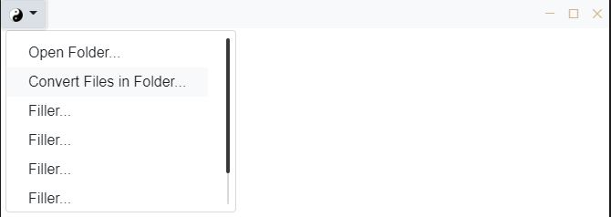

### This repo provides an skeleton/template for starting an Electron application with custom HTML-built titlebar & dropdown menu, best practices & security in mind
  
using [Bootstrap](https://getbootstrap.com/)

## Install:
```
npm install
npm run dev
```

## Tutorial:
This tutorial assumes users already have basic knowledge of Electron

---

Add _Bootstrap, jQuery & mCustomScrollbar_ to the _head_ section of `index.html`


---

Add window buttons on titlebar (credits to _binaryfunt's_ [seamless titlebar tutorial](https://github.com/binaryfunt/electron-seamless-titlebar-tutorial))


Add Bootstrap's dropdown menu, wrap them inside a flex-box

---

In `main.js`, create `BrowserWindow` with these configs   
* _`noteIntegration: false` is a recommended practice as it disallow using `require()` in the client, stopping malicious attacks from unstrusted users/sites_
* _as we will not have access to Nodejs's modules on the client side, we'd have to use a `preload` script to load required modules & expose only neccessary APIs_
* _we also set `contextIsolation: true` for removing access to the global `window` object in the preload script; for that we have to use the `ContextBridge`, making a clear separation between UI components & logic component (see the **handbrake-js** module in the example)_


---

In `preload.js`, load the javascript script to register action listeners for window buttons & dropdown menu


Register the actions of the window buttons (also register the actions of the dropdown menu here)

*We should have the titlebar working now*, next is to configure the `contextBridge`


---

The `exposeInMainWorld('bridge', ...)` will expose `ipcRenderer's` `send()` & `on()` methods, parameter validations can be done here


Just access the newly created `bridge` object under client's `window`


---
_Note: for Node.js module that access other programs, or process that are native to Node runtime only, exposing that entire module will not work on the browser side_  
We have to be a little creative here:

